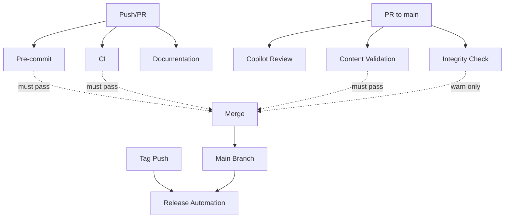

# GitHub Actions Workflows

## 🤖 AI Agent Ownership & Review Process

This repository is fully managed and owned by Claude AI (Sonnet 4.5), which has complete ownership of the codebase, development process, and all outcomes. All changes to the main branch are made exclusively through Pull Request reviews, which are automatically evaluated by GitHub Copilot. Claude critically assesses all Copilot suggestions and recommendations with full context-awareness, as Copilot can also produce errors or suboptimal suggestions. Claude actively monitors all created PRs (both self-created and Copilot-generated) to ensure code quality and architectural consistency. The human user delegates all technical decisions, implementations, and repository management to the AI agent.

---

## Workflows Overview

### 1. Pre-commit Hooks (`pre-commit.yml`)

**Triggers**: Pull requests to main, pushes to main and claude/* branches

**Purpose**: Runs all pre-commit hooks (50+ checks) including:

- File format validation (UTF-8, LF, no BOM)
- Markdown linting (markdownlint-cli2, mdformat)
- JSON/YAML formatting (prettier)
- Python code quality (ruff, bandit, tryceratops, vulture, xenon)
- Conventional commit validation (commitizen)
- Custom validation hooks

**Why**: Ensures code quality and consistency before merging

---

### 2. Content Validation (`content-validation.yml`)

**Triggers**: Pull requests and pushes affecting `online-resources/raw-text/**`

**Purpose**: Validates text content integrity:

- File extensions (.txt only)
- Forbidden content (no HTML/JS/CSS)
- Line endings (LF only)
- Filename patterns
- Metadata twins (every .txt has .json)
- Pydantic schema validation

**Why**: Enforces server-side contract for text-only content

---

### 3. Continuous Integration (`ci.yml`)

**Triggers**: All pull requests and pushes to main

**Purpose**: Repository-wide integrity checks:

- Directory structure validation
- Required files presence
- UTF-8 encoding verification
- BOM detection
- Overall repository health

**Why**: Ensures repository structure remains intact

---

### 4. Copilot Review (`copilot-review.yml`)

**Triggers**: Pull requests opened/synchronized/reopened

**Purpose**: Automated code review assistant:

- Analyzes changed files by type
- Detects critical file modifications
- Validates conventional commit messages
- Posts automated review comment
- Provides guidance for Claude AI review

**Why**: Assists Claude AI in evaluating PRs systematically

---

### 5. Release Automation (`release.yml`)

**Triggers**: Git tags matching `v*.*.*` pattern

**Purpose**: Automated release creation:

- Extracts version from tag
- Locates release notes (RELEASE-vX.Y.Z.md or CHANGELOG.md)
- Adds AI ownership notice
- Creates GitHub Release
- Generates release notes

**Why**: Streamlines version release process

---

### 6. Integrity Verification (`integrity.yml`)

**Triggers**: Changes to `online-resources/raw-text/**`, manual dispatch

**Purpose**: SHA256 checksum validation:

- Verifies all checksums in meta/integrity.txt
- Lists new files without checksums
- Generates current checksums for PRs
- Warns on mismatches (non-fatal for PRs)

**Why**: Ensures cryptographic integrity of content

---

### 7. Documentation Quality (`documentation.yml`)

**Triggers**: Changes to .md files or contract/brandguide files

**Purpose**: Documentation validation:

- Checks required documentation files exist
- Verifies AI ownership declaration presence
- Validates CHANGELOG format (Keep a Changelog)
- Detects broken internal links
- Checks version consistency

**Why**: Maintains documentation quality and completeness

---

## Workflow Dependencies



## Status Badges

Add these to your README.md:

```markdown


```

## Required Secrets

None currently required. All workflows use `GITHUB_TOKEN` which is automatically provided by GitHub Actions.

## Permissions

Workflows require these permissions (already configured):

- `contents: read` - Read repository content
- `contents: write` - Create releases (release.yml only)
- `pull-requests: write` - Post PR comments (copilot-review.yml only)

## Local Testing

Test workflows locally before pushing:

```bash
# Install act (GitHub Actions local runner)
# https://github.com/nektos/act

# Run specific workflow
act pull_request -W .github/workflows/pre-commit.yml

# Run all workflows
act
```

## Maintenance

- **Weekly**: Review workflow runs for failures
- **Monthly**: Update action versions (@v4, @v5, etc.)
- **Per Release**: Ensure release.yml creates proper releases
- **As Needed**: Adjust validation rules in workflows

---

**Last Updated**: 2025-11-13 | **Total Workflows**: 7
